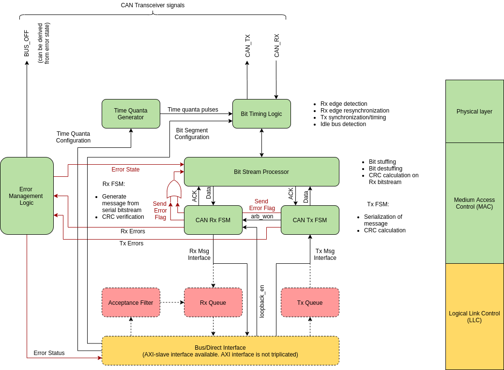

# Canola

A radiation-tolerant CAN bus controller for FPGA's written in VHDL.



A simplified block diagram of the controller is shown in the figure above. The controller offers a simple interface to send and receive messages. All of the main logic of the controller (in green) has been fully implemented and tested, and *can be configured* to use Triple Modular Redundancy (TMR) to achieve radiation tolerance. A simple direct interface to send and receive messages is available, as well as an AXI-slave. (Note: the AXI-slave is not triplicated).

Some common features found in CAN controllers, such as acceptance filtering and Rx/Tx queues, have not been implemented (those are marked in red in the diagram). Those features are not necessary in many applications, and have currently been omitted in order to minimize the size of the logic (and hence the radiation cross-section).

The controller aims to be fully CAN 2.0B compliant (though it has not been tested with Bosch's VHDL Reference CAN).


## A note on radiation tolerance

To achieve the radiation tolerance whole blocks of logic are triplicated (Block-TMR), and outputs from the blocks are voted. A combination of single-output and triple-output majority voters are used. In order to reduce the logic size, most non-critical signals use single-output voters. But in certain places triple-output voters are used, such as for the FSM state registers and the CRC calculation. The FSM state register and CRC registers are also updated based on the majority voted value on every clock cycle, so single bit errors in these registers are effectively corrected on every clock cycle.

This mitigation strategy is suitable for SRAM-based FPGAs combined with scrubbing of the configuration memory. In principle it should also work for flash-based FPGAs where scrubbing is not necessary, but the Block-TMR approach may not be optimal in that case. A suggestion for flash-based FPGAs is to use the non-triplicated version of the controller and allow the synthesis tools to perform TMR at the register-level.

Note: As of September 2020 the radiation tolerance of the controller has not been beam-tested.

And as a final remark it should be mentioned that **the controller is fully usable for normal applications and the triplication can be disabled in its entirety**.


## Simulating

Simulating the CAN controller requires modelsim and the UVVM framework to be present:
https://github.com/UVVM/UVVM

The UVVM framework has already been added to the repo as a submodule. To fetch it, simply run:

``
git submodule init
``

Assuming that `vsim` is in your path, running `make` from the top-level directory of the repository will run the testbench.

### Simulation options

There are several testbenches for the different top-level entities for Canola, as well as the different submodules. When make is invoked without parameters, the default (main_no_tmr) testbench is simulated. The possible make targets are listed in the table below.
Coverage can also be simulated by setting the environment variable COVERAGE to 1. E.g.:

``
make batch_all COVERAGE=1
``

Will run all testbenches, simulate coverage, and generate a coverage report. The report can be found in run/covhtmlreport.


| TB option              | Description                                                                                                     |
|------------------------|-----------------------------------------------------------------------------------------------------------------|
| main_no_tmr            | Simulate main testbench for Canola CAN controller using canola_top.vhd. No TMR.                                 |
| main_tmr_wrap_no_tmr   | Simulate main testbench for Canola CAN controller using canola_top_tmr.vhd, but with TMR disabled.              |
| main_tmr_wrap_tmr      | Simulate main testbench for Canola CAN controller using canola_top_tmr.vhd, with TMR enabled.                   |
| btl                    | Simulate testbench for Bit Timing Logic (BTL)                                                                   |
| bsp                    | Simulate testbench for Bit Stream Processor (BSP)                                                               |
| eml                    | Simulate testbench for Error Management Logic (EML)                                                             |
| axi_tb_no_tmr          | Simulate testbench for Canola CAN controller AXI slave using canola_axi_slave.vhd. No TMR.                      |
| axi_tb_tmr_wrap_no_tmr | Simulate testbench for Canola CAN controller AXI slave using canola_axi_slave_tmr.vhd, but with TMR disabled.   |
| axi_tb_tmr_wrap_tmr    | Simulate testbench for Canola CAN controller AXI slave using canola_axi_slave_tmr.vhd, with TMR enabled.        |
| opencores              | Simulate testbench with an instance of Canola CAN Controller, and an instance of CAN controller from opencores. |
| tmr_voters             | Simulate testbench for TMR voters.                                                                              |
| tmr_counters           | Simulate testbench for upcounter and saturating counter. Simulates the counters both with and without TMR.      |
| batch_all              | Simulate all the testbenches (batch mode, no gui)                                                               |


### Simulating Canola CAN with CAN controller available at opencores.org

The test bench located in `source/bench/canola_vs_opencores_can_tb.vhd` tests communication between an instance of the Canola CAN controller and the CAN controller available at opencores.org.

Running this test bench requires:
- UVVM
- UVVM Community VIP for Wishbone
- Opencores CAN controller

For UVVM, see previous section.

The UVVM Community VIPs are available here:
https://github.com/UVVM/UVVM_Community_VIPs/

This is the exact commit of the Community VIPs that was used for testing:
https://github.com/UVVM/UVVM_Community_VIPs/tree/3a8ec8a82a50bcef1fcd291a885cfd48bff3cc60

Unfortunately the compile scripts in the UVVM framework expects the VIPs to be located in the UVVM directory, so I was not able to add the Community VIPs as a submodule in a reasonable manner. Instead, copy the bitvis_vip_wishbone_BETA directory from the Community VIP to the extern/UVVM directory, and rename it bitvis_vip_wishbone.

The .v files for the CAN controller from opencores.org should be placed in extern/can_controller/.

You also have to uncomment this line `// `define   CAN_WISHBONE_IF` in can_defines.v to enable the wishbone interface to the CAN controller.
    

### Simulation logs

Simulation logs for each testbench and configuration are stored in run/log.


## Configuration of CAN controller

A summary of the configurable quantities in the Canola CAN controller follows. Exactly how to configure them depends on which top-level entity for Canola is used, which is either the AXI-slave (`source/rtl/axi_slave/canola_axi_slave.vhd`), or one of the top-level entities with a direct interface (`source/rtl/canola_top.vhd` or `source/rtl/canola_top_tmr.vhd`).

### Bit timing and timing segments

Wikipedia has a pretty good page on CAN bus, which explains bit timing in CAN rather well:
https://en.wikipedia.org/wiki/CAN_bus#Bit_timing

#### Time quanta configuration

A simple clock divider ('source/rtl/canola_time_quanta_gen.vhd') generates a pulse for each time quanta to the Bit Timing Logic (BTL). The TIME_QUANTA_CLOCK_SCALE input to the BTL ('source/rtl/canola_btl.vhd') configures the count value for the time quanta generator. One time quanta is Tclk x (1 + TIME_QUANTA_CLOCK_SCALE) long.

The time quanta scale is configured by the `BTL_TIME_QUANTA_CLOCK_SCALE` register in the AXI-slave for the controller. In the `canola_top` and `canola_top_tmr` entities it is configured by the `BTL_TIME_QUANTA_CLOCK_SCALE` input.

#### Time segments configuration

The timing segments in Canola are implemented as a simple shift register. The configured values for the timing segments, PROP_SEG, PHASE_SEG1, and PHASE_SEG2, should be set up with a sequence of '1' bits corresponding to the length of the segment, starting at the LSB. The segment ends when a '0' is encountered.

For example, to configure the propagation segment for 2 time quantas, the first phase segment for 3 time quantas, and the second phase segment for 4 time quantas:

PROP_SEG = 00000011
PHASE_SEG1 = 00000111
PHASE_SEG2 = 00001111

Since the segment ends when the first '0' is encountered, technically this is how the values above are processed:

PROP_SEG = XXXXX011
PHASE_SEG1 = XXXX0111
PHASE_SEG2 = XXX01111

The time of one baud, in terms of time quantas, is equal to the sum of the length of the time segments, plus one. I.e.:

1 + PROP_SEG + PHASE_SEG1 + PHASE_SEG2

The additional time quanta is due to the sync segment, which is always one time quanta long (See Length of Time Segments, CAN specification 2.0B page 66).

The time segments are configured by the `BTL_PROP_SEG`, `BTL_PHASE_SEG1`, and `BTL_PHASE_SEG2` registers in the AXI-slave. In the `canola_top` and `canola_top_tmr` entities it is configured by the `BTL_TIME_QUANTA_CLOCK_SCALE` input.

**Note: The Canola controller does not enforce or verify correctness of the timing values, this is the responsibility of the user. Refer to Length of Time Segments, CAN specification 2.0B page 66, when configuring time segments.**

**Warning: PHASE_SEG2 should NOT be configured shorter than PHASE_SEG1, as per the CAN specification. This is not checked by the controller, and it is the responsibility of the user to configure it correctly.**

#### (Re)Syncronization Jump Width (SJW) configuration

Rising/falling edges are expected to occur during the synchronization segment in a CAN controller. Resynchronization is performed on falling edges that fall outside of the synchronization segment. This is performed by either lengthening the PHASE_SEG1 segment, or shortening the PHASE_SEG2 segment. The SJW specifies the maximum amount that the phase segments may be lengthened or shortened by, in terms of time quantas.

The SJW is configured by the `BTL_SYNC_JUMP_WIDTH` register in the AXI-slave. In the `canola_top` and `canola_top_tmr` entities it is configured by the `BTL_SYNC_JUMP_WIDTH` input.

**Warning: As per the CAN specification, the SJW should not be longer than PHASE_SEG1. This also implies that SJW should not be longer than PHASE_SEG2. This is not checked by the controller, and it is the responsibility of the user to configure it correctly.**


#### Triple sampling of received bits

The Rx sample point in a CAN controller is at the start of the second phase segment (and for reference, the Tx sample point is at the beginning of the sync segment).
When triple sampling is enabled, the controller will sample the bit value at the Rx sample point, and also at the two time quantas before the Rx sample point. A majority vote of these three values will determine the bit value.

Triple sampling is enabled by setting the `BTL_TRIPLE_SAMPLING_EN` bit to '1' in the `CONTROL` register in the AXI-slave. In the `canola_top` and `canola_top_tmr` entities it is enabled by setting the `BTL_TRIPLE_SAMPLING` high.


## Using the controller in a Zynq/AXI design in Vivado

There are two top level entities for an AXI slave with the controller; canola_axi_slave and canola_axi_slave_tmr.

The CAN controller is written for VHDL 2008. Vivado supports VHDL 2008, but does not allow it for top level entities for blocks used in a block design. When adding files for the CAN controller, set the VHDL standard to normal VHDL for canola_axi_slave and canola_axi_slave_tmr, and set the standard to VHDL 2008 for the remaining files in the controller.

It should be possible to create instances of canola_axi_slave and canola_axi_slave_tmr in the block design by right clicking somewhere in the design, and choosing Add Module. They should appear in the list if the VHDL standard is configured correctly (if not they may appear among the incompatible modules when unchecking the checkbox for that).

The controllers can also be manually added to the block design from the TCL console:

create_bd_cell -type module -reference canola_axi_slave_tmr canola_axi_slave_0

The AXI address of the controller has to be configured in two places: the address editor, and in the generic G_AXI_BASEADDR. G_AXI_BASEADDR can be changed by right clicking the block, and clicking Customize Block. Settings for TMR for canola_axi_slave_tmr can be changed in the same window.


## Test project for Zynq ZYBO board

The repository includes a test project on the Digilent ZYBO Zynq board is available for the controller. It is a Zynq processor block design with four instances of the Canola controller, and software for testing is also included in the repository. The software configures the controllers for a bitrate of 1 Mbit.
The project is for the [original ZYBO board](https://store.digilentinc.com/zybo-zynq-7000-arm-fpga-soc-trainer-board/), but could probably be adapted for newer versions of the board without too much difficulty.


### Setup Vivado project

The canola_test.tcl script in the vivado/ directory allows the project to be created. It was made using Vivado version 2018.3, but may work for other version.

To create the project (on linux), source the Vivado settings file (change the path to where ever your Vivado installation resides):

```console
$ . /opt/Xilinx/Vivado/2018.3/settings64.sh
```

Then from the top directory of the Canola repository, run Vivado with the following parameters:

```console
$ vivado -mode gui -source "vivado/canola_test.tcl"
```

And finally run implementation and generate bitstream.


### Setup Xilinx SDK firmware project

The firmware/software project for the Zynq is written in C and resides in software/canola_zynq_test/.

Before the firmware can be compiled you will have to generate the projects for the Zynq CPU and BSP (Board Support Package) for the canola_test Zynq design.

#### Step 1 - Export hardware from Vivado

From the Vivado GUI, choose File -> Export Hardware. Choose "Export to: Local to Project". If you want to be able to program the FPGA from the Xilinx SDK, check the "Include bitstream" box (can be left unchecked if you want to program the FPGA from Vivado).


#### Step 2 - Launch Xilinx SDK

From the Vivado GUI, choose File -> Launch SDK. Leave both "Exported location" and "Workspace" to "Local to Project".


#### Step 3 - Create BSP project in Xilinx SDK

From Xilinx SDK, choose File -> New -> Board Support Package to create a new BSP project for the design.


The settings should be as in the image shown above. Choose to have the project created in the default location, and give the project the name "canola_test_bsp", because this is what the project for the actual Zynq firmware expects. 

Click Finish, and in then OK in the next window for the Board Support Package Settings (shown in the image below). The test project does not use any of the additional support libraries.


#### Step 4 - Import Canola test project in Xilinx SDK

Finally, choose File -> Import in Xilinx SDK, and choose General -> Existing Projects into Workspace, as shown in the image below. The path to the project is software/canola_zynq_test/.


Set the root directory to the project in software/canola_zynq_test/. The import window should look something like in the image below then. Then click Finish.


#### Step 5 - Build and launch project

You should now be able to build the firmware. Right click the canola_zynq_test project in the Project Explorer, and select Build Project. It should compile without any problems.

After compiling, right click the project again and select Debug As -> "Launch on Hardware (System Debugger)". Allow the debug perspective to be opened, and remember to click the resume button (play/pause icon, or Run->Resume) to start the debugger.

Obviously you can also run the project without the debugger if you don't need or want it.


### Using the test firmware

#### UART status messages

The test firmware outputs some status messages and register values for the Canola controllers when it starts up on the JTAG UART. It should look something like below:

```
Starting...
-------------------
Initializing interrupts...
Initializing GPIO...
SW: 0
BTN: 0

Initializing Canola CAN controllers...
--------------------------------------
CONTROL: 0000000000
CONFIG: 0000000000
STATUS: 0000000000
BTL_PROP_SEG: 0x00000007
BTL_PHASE_SEG1: 0x00000007
BTL_PHASE_SEG2: 0x00000007
BTL_SYNC_JUMP_WIDTH: 0x00000001
BTL_TIME_QUANTA_CLOCK_SCALE: 0x00000009

Device 0:
-------------
STATUS: 0000000000
TRANSMIT_ERROR_COUNT: 0
RECEIVE_ERROR_COUNT: 0
TX_MSG_SENT_COUNT: 0
TX_ACK_RECV_COUNT: 0
TX_ARB_LOST_COUNT: 0
TX_ERROR_COUNT: 0
RX_MSG_RECV_COUNT: 0
RX_CRC_ERROR_COUNT: 0
RX_FORM_ERROR_COUNT: 0
RX_STUFF_ERROR_COUNT: 0
CONTROL: 0000000000
CONFIG: 0000000000
STATUS: 0000000000
BTL_PROP_SEG: 0x00000007
BTL_PHASE_SEG1: 0x00000007
BTL_PHASE_SEG2: 0x00000007
BTL_SYNC_JUMP_WIDTH: 0x00000001
BTL_TIME_QUANTA_CLOCK_SCALE: 0x00000009

...

```

When a test mode is active, status messages are displayed periodically (see below).

The UART for the ZYBO board typically appears as /dev/ttyUSB1 in Linux (unless you had other USB UART/serial devices connected already). The baud rate is 115200.


#### Observing CAN messages

With a CAN adapter for your PC you can observe the messages transmitted by the Canola CAN controllers. It has been tested with [PEAK System's PCAN-USB](https://www.peak-system.com/PCAN-USB.199.0.html?&L=1)

SocketCAN must be setup in Linux before you can use the CAN adapter. The setup_socketcan.sh script takes care of loading the necessary kernel modules for CAN and SocketCAN, and sets up the can0 interface with a bitrate of 1 Mbit:

```console
$ sudo software/setup_socketcan.sh
```

When the can0 interface is up, you can view incoming CAN messages using candump:

```console
$ candump -L -x can0
```

Or if you want more information about the messages, cansniffer can be used instead:

```console
$ cansniffer can0
```

#### Starting transmission from Canola controllers on Zynq board

The current version of the test firmware has 3 test modes:

* Manual mode
* Continuous mode
* Sequence mode


##### Manual mode

Turn SW0 on and leave the other switches off to enter the manual test mode.

While in the manual test mode, messages are sent when the push buttons are pressed. Button BTN0 sends messages from Canola instance 0, BTN1 from instance 1, and so on.

Turn SW0 off again to leave the manual test mode.


##### Continuous mode

Turn SW1 on and leave the other switches off to enter the continuous test mode.

In this mode transmissions of random data are continuously started from the controllers when they are not busy. Transmissions will be started from several controllers at the same time, and allows the loss of arbitration to be tested.

Status counters are printed after every 10000 message.

Turn SW1 off again to leave the continuous test mode.


##### Sequential mode

Turn SW2 on and leave the other switches off to enter the continuous test mode.

In this test mode transmissions of random data are started from one controller at a time. The test waits for 2 milliseconds after each transmission has been started, which should be sufficient for a CAN message of any length at 1 Mbit. After waiting it verifies that it received the Tx done interrupt from the transmitting controller, and that it got Rx message interrupt from the receiving controllers. The firmware has counters for success, failure, and number of messages sent and received. The counter values are printed when the test is stopped. Counter registers in the controllers are printed for every 10000 message that is sent.

Turn SW2 off again to leave the continuous test mode.
